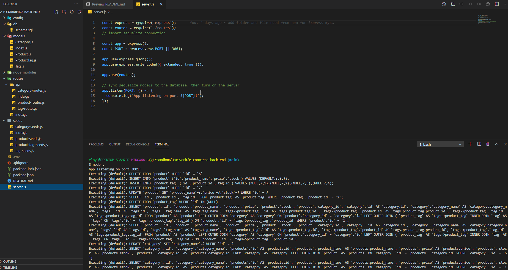
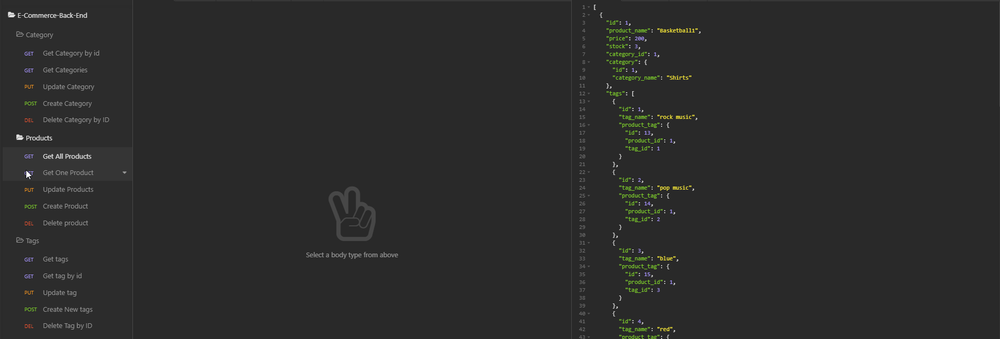

# e-commerce-back-end
e-commerce back end

## Table of Contents
 1. [Description](#description)
 1. [Installation](#installation)
 1. [Usage](#usage)
 1. [Screenshots](#screenshots)
 1. [Details](#details)
 1. [Contributing](#contributing)
 1. [Questions](#questions)

 ## Decription

Internet retail, also known as **e-commerce**, is the largest sector of the electronics industry, generating an estimated $29 trillion in 2019. E-commerce platforms like Shopify and WooCommerce provide a suite of services to businesses of all sizes. Due to their prevalence, understanding the fundamental architecture of these platforms will benefit you as a full-stack web developer.

This Project build's the back end for an e-commerce site by modifying starter code. It uses  Express.js API to use Sequelize to interact with a MySQL database.

Because this application won’t be deployed, I will provide a link to a walkthrough video that demonstrates its functionality and all of the acceptance criteria being met. 

 ## Insatllation

 npm i

 ## Usage

 Need to run node server.js to run.

### Screenshot

Terminal Project running example:

Isnomia Api's calls:

### Details

Github Repo link:

[Github Repo link](https://github.com/eloy522752868/e-commerce-back-end)

Video link below:

[Video Instructions](https://drive.google.com/file/d/1Q6tb3A3lct3mIPzfkeBjk8R86xF3MiNa/view)

 ## Contributing

If like to add to this project or have any question please reach me via my profile below.

 ## Questions

If you have any question or need to report a issues, please contact me on email below.

[My Profile:](https://github.com/eloy522752868)

